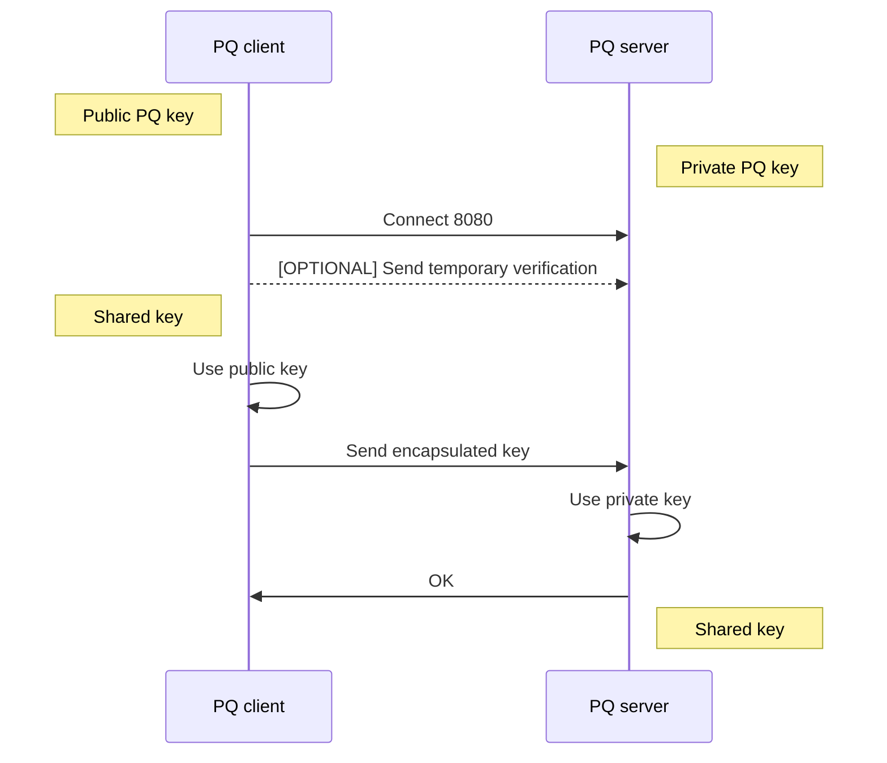
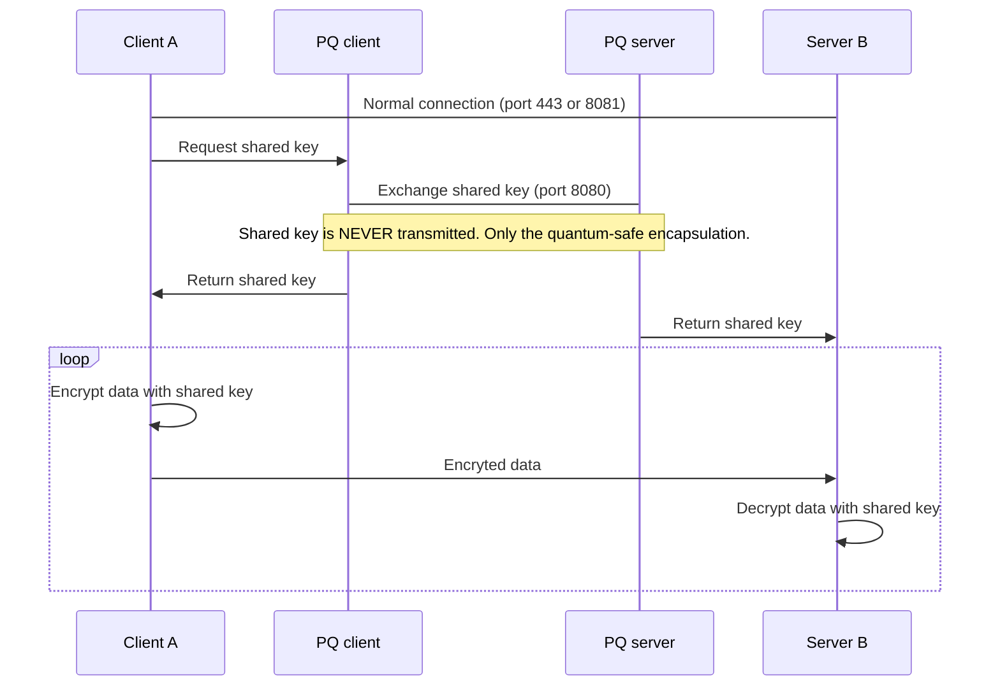

# Electrocomms

Provide Quantum resistant communications without changing existing stacks.

This is part of the *STRONGBOX* component, into the WP4, in the [ELECTRON (UE funding) project](https://electron-project.eu/). 

Selected algorithms:
- for the Post-Quantum asymmetric key exchange mechanism: Crystals-Kyber 1024
- for the symmetric encryption with authentication enabled: ChaCha20-Poly1305

## Demos

> See the [demo](/demo) folder containing code and documentation. 

### Simple demo

As command line applications. The applications just exchange a shared key.

### Integrated demo

Two systems exchanging data at port 8081. When a quantum-safe key is required, the systems call PQClient and PQServer to exchange a safe key over the port 8080. Then, these systems can encrypt and transmit data by using that shared key. Note also that Client and PQ client intaraction(same with server) is always done locally.

## Usage

Developers: Download source code, then execute `make` in the src folder.
Users: use a pre-compiled binary from /dist folder.

> Note: At this stage of the project, the public key must be kept secret for everybody but the allowed clients. See reasoning and alternatives [here](/src/kyber1024/LICENSE). 

To display help: `./electrocomms`

To start the server: `./electrocomms 8080` (In the first run, an new pair of keys is generated automatically)

To start the client: `./electrocomms 127.0.0.1 8080`

## Selection of the PQ alternatives

There are many approaches to Post-Quantum (PQ) communications. Each one of them has advantages but also important drawbacks.

|Approach|Advantages|Disadvantages|
|---|---|---|
|Openssl fork with PQ|Versatility, PQ certificates instead of keys | No ROOT CA to sign certificate, slower than other options| not all chip architectures|not suitable for embedded|
|Nginx fork with PQ|Server ready to use|Client must be also a PQ (new client or change the client stack)|
|Pre shared Key (PSK) into TLS|Use only the external PQ for shared key. TLS1.3 already allow this|Existing programs may not have PSK as public method in code, so external implementation is still required|
|Using Qdefender lib|Faster to develop|Qdefender license is Tecnalia proprietary for now|
|Plain C implementation|Better suited for servers and embedded, open source is possible|Only for simple scenarios, ad-hoc code|

For the Electron project, since many elements are not still defined, we will opt for the plain C implementation focused on server to server communication. Reasons:
- if the C program is kept simple, it could be also used for low resources systems, with some effort. Other options will never be capable in embedded due to RAM, cycles or size of binary, compilation issues etc.
-  external dependencies (algorithms) can be  linked as open source. The project license can be set to Free and Open Source Project (FOSS). This is a positive point for the European comission funding the Electron project.

## Selection of the algorithms

For the asymmetric part (the key exchange mechanism or KEM), KYBER will be selected. Reasons:
- Selected for standardization in the third round of NIST.
- Lattice family performs really well in most architectures

For the symmetric part (the encryption of data to be transmitted securely) [STILL TO BE SELECTED]

## Licenses

All licenses are permisive open source, see LICENSE file on each subfolder:
- current project: [MIT](/LICENSE)
- Kyber implementation: [Creative Commons Zero CC0](/src/kyber1024/LICENSE)

## Disclaimer

**[ELECTRON "rEsilient and seLf-healed EleCTRical pOwer Nanogrid"](https://electron-project.eu/)**

Call: H2020-SU-DS-2020, Topic: U-DS04-2018-2020, Start Date: 01/10/2021, Duration: 36 months.

This project has received funding from the European Union’s Horizon 2020 research and innovation programme under Grant Agreement No. 101021936.

